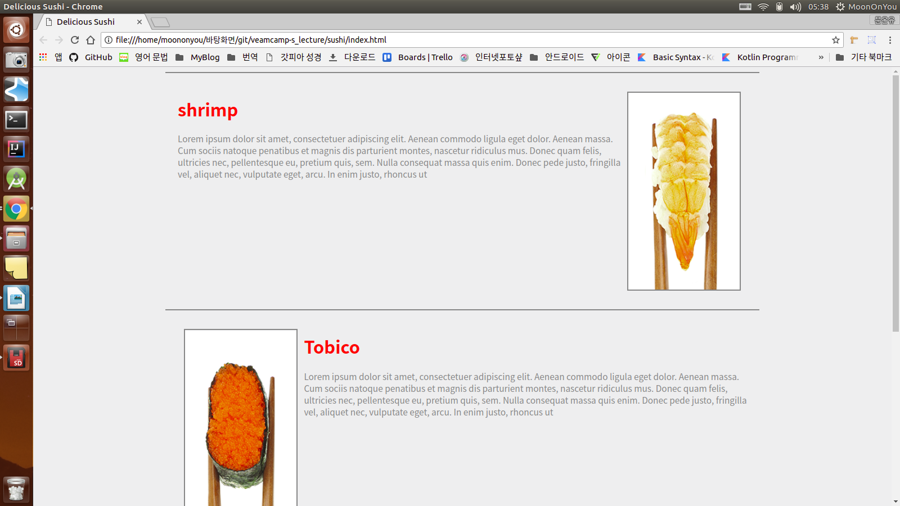
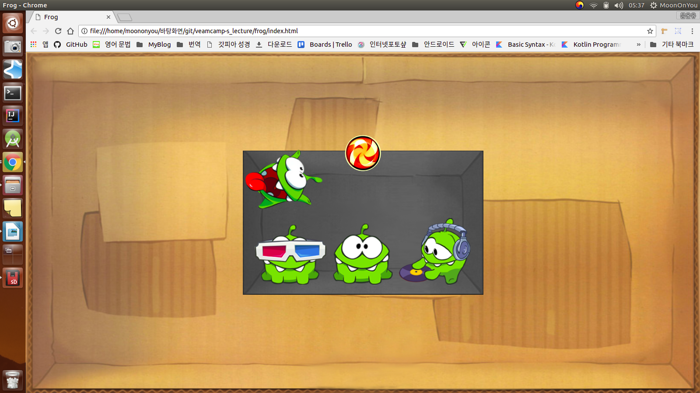

# veamcamp-s_lecture
"빔캠프"수업에서의 실습 내용들을 정리
<<<<<<< HEAD
시연 영상 링크 : https://youtu.be/FQWBKi0KIi4

### CSS의 float속성을 정확하고 올바르게 이해하기 위한 과제

### CSS 레이아웃 속성 중, 상대적 위치와 절대적 위치를 이해하기 위한 과제로써 CSS3의 속성을 덧붙여 애니메이션 효과를 표현

